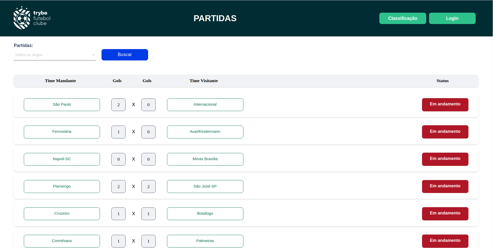

<h1> Trybe Futebol Club </h1>

<h2> About the project </h2>

</blank> 

 
  
This project was developed in the back-end course, where it a REST API was developed that creates and manipulates a MySQL database, authenticates registered users through a login, lists a leaderboard with all teams being able to filter by performance as home or visitor, lists and adds, updates and ends matches.

 

<h2> Skills </h2>

<ul> 

<li>Use Docker and Docker-compose to manage container environment;</li>
<li>Use MSC architecture;</li>
<li>Use TypeScript and OOP(Object-Oriented Programming) with SOLID principles;</li>
<li>Use Express framework from Node.js and ORM library Sequelize for MySQL database modeling;</li>
<li>Use JWT and bcrypt libraries to authenticate users and create a hash of user information;</li>
<li>Practice TDD with integration tests using _Mocha, Chai and Sinon.</li>

</ul> 

<h2>Contact </h2>

 For more information contact us: 

